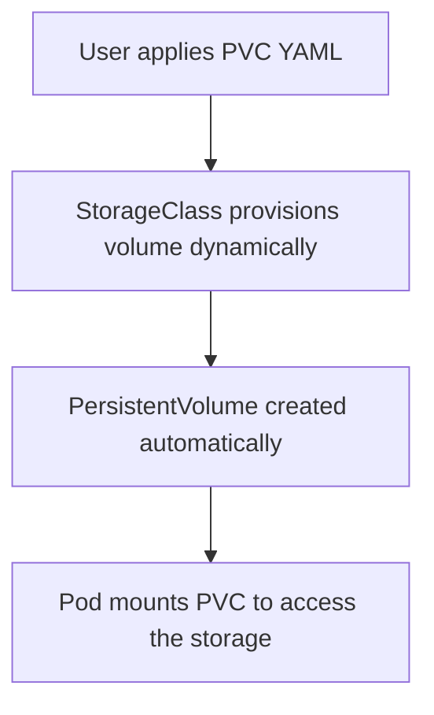

# ☸️ Day 12 — GKE Storage Classes, Persistent Volumes & PersistentVolumeClaims


---

## 🎯 **Objective**
Understand how Kubernetes manages persistent storage using **StorageClasses**, **PersistentVolumes (PV)**, and **PersistentVolumeClaims (PVC)** in **Google Kubernetes Engine (GKE)**.

---
## 🧱 How These Three Work Together

### 🔁 Workflow Diagram (Simple View)

```plaintext
+-------------------+
|   StorageClass    | --> Defines how storage is created
+-------------------+
          ↓
+-------------------+
| PersistentVolume  | --> The actual physical storage
+-------------------+
          ↓
+-------------------+
| PersistentVolumeClaim | --> A user's request for storage
+-------------------+
          ↓
+-------------------+
|        Pod        | --> Uses the PVC as a volume
+-------------------+
```

---

## 🧠 **Concept Overview**

### 🔹 1. What is a Persistent Volume (PV)?
- A **PersistentVolume** is a piece of storage in the cluster that has been provisioned by an administrator or dynamically by a **StorageClass**.
- PVs are **cluster-level resources**, independent of Pods.
- They are backed by physical storage — for example: **GCE Persistent Disk, NFS, or AWS EBS**.

### 🔹 2. What is a Persistent Volume Claim (PVC)?
- A **PersistentVolumeClaim** is a user’s **request for storage**.
- It describes:
  - How much storage it needs (e.g., 1Gi)
  - What access mode (ReadWriteOnce, ReadOnlyMany, ReadWriteMany)
  - Which storage class to use

### 🔹 3. What is a StorageClass?
- A **StorageClass** provides a way to describe the “classes” of storage offered by a cluster (for example, **standard**, **ssd**, **premium-rwo**, etc.).
- It defines the **provisioner**, **reclaim policy**, and **parameters**.

---

## 🧩 **GKE Storage Provisioning Flow**



---

## ⚙️ **Static Provisioning Example**

### 1️⃣ Create a Persistent Volume (PV)
```yaml
apiVersion: v1
kind: PersistentVolume
metadata:
  name: static-pv
spec:
  capacity:
    storage: 1Gi
  accessModes:
    - ReadWriteOnce
  storageClassName: manual
  persistentVolumeReclaimPolicy: Retain
  gcePersistentDisk:
    pdName: my-static-disk
    fsType: ext4
```

### 2️⃣ Create a Persistent Volume Claim (PVC)
```yaml
apiVersion: v1
kind: PersistentVolumeClaim
metadata:
  name: static-pvc
spec:
  accessModes:
    - ReadWriteOnce
  storageClassName: manual
  resources:
    requests:
      storage: 1Gi
```

### 3️⃣ Create a Pod using the PVC
```yaml
apiVersion: v1
kind: Pod
metadata:
  name: static-pod
spec:
  volumes:
    - name: my-storage
      persistentVolumeClaim:
        claimName: static-pvc
  containers:
    - name: app
      image: nginx
      volumeMounts:
        - mountPath: "/usr/share/nginx/html"
          name: my-storage
```

### 🧪 Commands to Test
```bash
kubectl apply -f pv.yaml
kubectl apply -f pvc.yaml
kubectl apply -f pod.yaml

kubectl get pv,pvc
kubectl describe pv static-pv
kubectl describe pvc static-pvc
kubectl exec -it static-pod -- /bin/bash
```

---

## ⚙️ **Dynamic Provisioning Example**

### 1️⃣ Create a StorageClass
```yaml
apiVersion: storage.k8s.io/v1
kind: StorageClass
metadata:
  name: standard-rwo
provisioner: kubernetes.io/gce-pd
parameters:
  type: pd-standard
  replication-type: none
reclaimPolicy: Delete
volumeBindingMode: WaitForFirstConsumer
```

### 2️⃣ Create a PVC that uses the StorageClass
```yaml
apiVersion: v1
kind: PersistentVolumeClaim
metadata:
  name: dynamic-pvc
spec:
  accessModes:
    - ReadWriteOnce
  storageClassName: standard-rwo
  resources:
    requests:
      storage: 2Gi
```

### 3️⃣ Create a Pod that uses this PVC
```yaml
apiVersion: v1
kind: Pod
metadata:
  name: dynamic-pod
spec:
  volumes:
    - name: dynamic-storage
      persistentVolumeClaim:
        claimName: dynamic-pvc
  containers:
    - name: web
      image: nginx
      volumeMounts:
        - mountPath: "/usr/share/nginx/html"
          name: dynamic-storage
```

### 🧪 Commands to Apply
```bash
kubectl apply -f storageclass.yaml
kubectl apply -f pvc.yaml
kubectl apply -f pod.yaml

kubectl get sc,pv,pvc
kubectl describe pvc dynamic-pvc
```

---

## 🔍 **Verification Commands**

| Command | Description |
|----------|--------------|
| `kubectl get sc` | List all StorageClasses |
| `kubectl get pv` | List all PersistentVolumes |
| `kubectl get pvc` | List all PersistentVolumeClaims |
| `kubectl describe pv <name>` | Get detailed info about a PV |
| `kubectl describe pvc <name>` | Get detailed info about a PVC |
| `kubectl delete pvc <name>` | Delete a PVC |
| `kubectl delete pv <name>` | Delete a PV |

---

## 🧹 **Cleanup Commands**
```bash
kubectl delete pod static-pod dynamic-pod
kubectl delete pvc static-pvc dynamic-pvc
kubectl delete pv static-pv
kubectl delete sc standard-rwo
```

---

## ⚠️ **Troubleshooting Tips**
- If a PVC is stuck in **Pending** state → check if a matching **StorageClass** exists.
- Ensure your **GCE Persistent Disk** name is correct for static provisioning.
- For dynamic provisioning, GKE automatically creates the disk in your project — check via:
  ```bash
  gcloud compute disks list
  ```
- Reclaim policy:
  - `Delete`: deletes disk when PVC deleted.
  - `Retain`: keeps disk after deletion for manual cleanup.

---

## 🧾 **Summary Table**

| Feature | Static Provisioning | Dynamic Provisioning |
|----------|---------------------|----------------------|
| PV Created | Manually | Automatically |
| StorageClass Required | Optional | Mandatory |
| Disk Managed By | Admin | Kubernetes |
| Flexibility | Low | High |

---

## 🚀 **Hands-On Lab Recap**
✅ Created PV, PVC, and Pods (Static & Dynamic)  
✅ Understood GKE’s default storage behavior  
✅ Verified and cleaned up all resources  
✅ Learned reclaim policies and troubleshooting steps  

---


